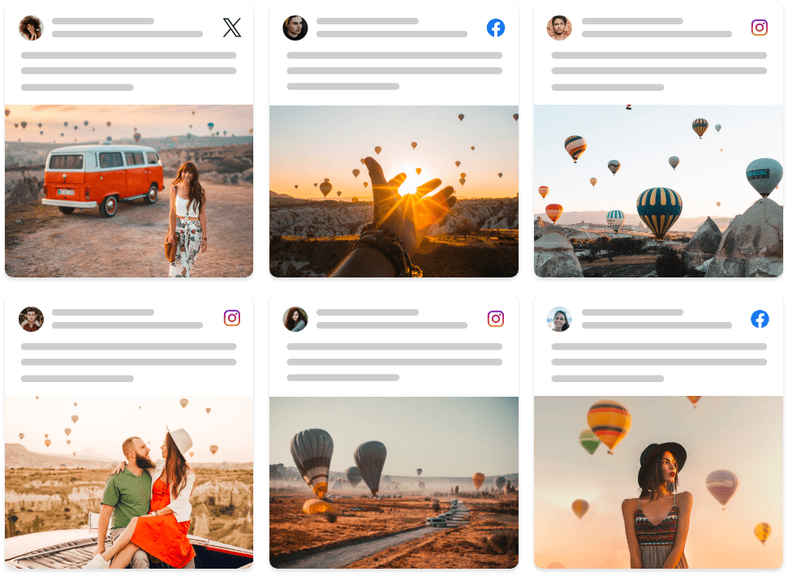
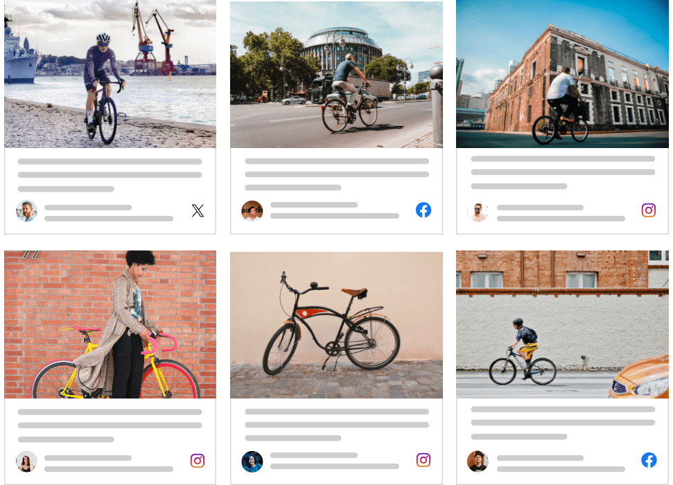
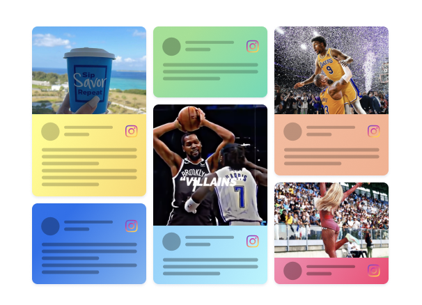
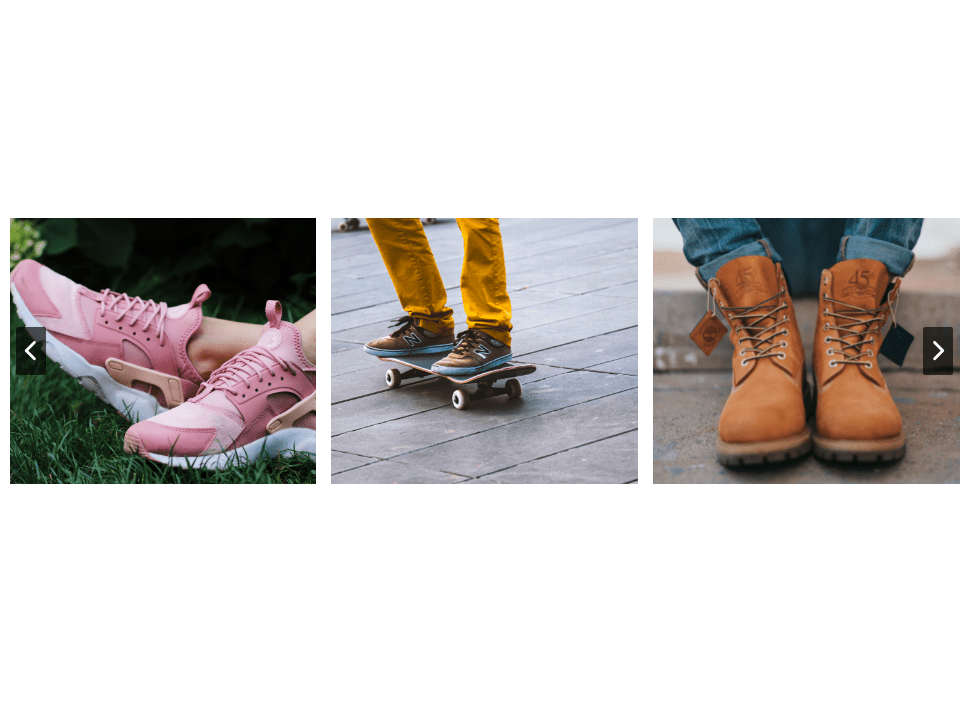
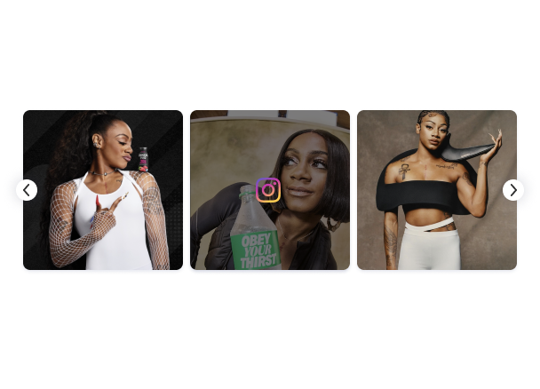
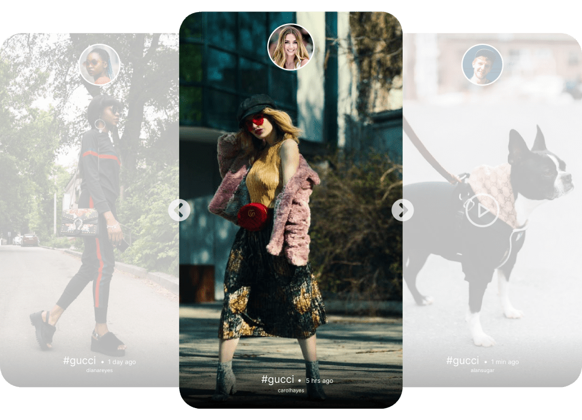
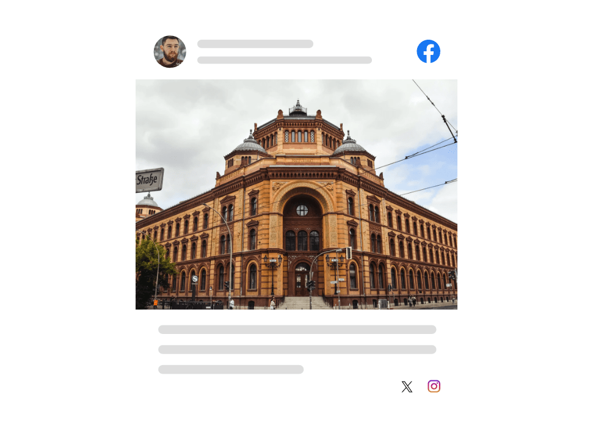

# Widget themes — pick one, build from its preview

The 19 widget themes a Taggbox Social Widget build can wear: 14 for social
posts, 5 for reviews. Each one has a thumbnail of the real widget (to pick
from), a finished HTML preview of it (to build from), a line on its layout
and the values its colours, font and spacing come from.

Fetch this file RAW. Thumbnails are PNGs beside it, and the previews are HTML
files in the `previews` folder next to this one:

```
https://raw.githubusercontent.com/wallapi/taggbox.com-API-Docs/main/guides/themes/<file>.png
https://raw.githubusercontent.com/wallapi/taggbox.com-API-Docs/main/guides/previews/<theme>.html
```

The thumbnail is for the question only. Once a theme is picked, the build
comes from its preview HTML, never from the thumbnail.

## Agents: ask first

Before writing any code, fetch the theme picker RAW and show it to the user
as an HTML artifact, exactly as it is:

```
https://raw.githubusercontent.com/wallapi/taggbox.com-API-Docs/main/guides/themes/thumbnails.html
```

It is one small page with every theme's name and its thumbnail, the images
embedded as base64 so they show inside the chat. Copy the file character for
character, the base64 included: never retype, shorten, resize or redraw it,
and add nothing to it. Then ask which theme they want. Take the name or its
place in the list. If they already named a theme, skip the question. Never
pick one for them at random.

If you cannot make an artifact, show the table below instead, exactly as it
is — two columns only, the theme name and its thumbnail image.

## The list

| Theme | Thumbnail |
| ----- | --------- |
| Classic Card |  |
| Social Card |  |
| Modern Card |  |
| Classic Photo |  |
| Square Photo |  |
| Collage |  |
| Vivid |  |
| Horizontal Slider |  |
| Horizontal Columns |  |
| Slider |  |
| Reels |  |
| Story Theme |  |
| Single Post |  |
| Widget Theme |  |
| Review Box |  |
| Review Carousel |  |
| Review List |  |
| Rating Badge |  |
| Badge |  |

## How a theme becomes the build

- **Build from the picked theme's preview HTML, not its thumbnail.** Fetch
  the *Preview* file under the theme below RAW before writing any code. It is
  the finished widget with sample posts: its `<style>` block and its card
  markup (`.tbx-widget`, `.tbx-track`, `.tbx-card` and the parts inside a
  card) are the design. Copy that CSS as it is and repeat that card markup for
  every post: same classes, same order of parts, same `--tbx-*` values in
  `:root`. Do not redraw the layout from the thumbnail or the *Look* line.
- **Take the structure, never the posts.** The preview's posts, names,
  avatars, links and image URLs are placeholders: do not copy a single one of
  them into the build. The posts come from the sample posts JSON (or the live
  API), exactly as the build prompt says, with every image and video URL
  copied from that JSON character for character. Render each post's author
  name, date, `content.text`, media and network in the preview's elements.
  Drop the sample-only bits: the base64 `--tbx-ph` placeholder on
  `.tbx-media`, the `.tbx-note` line and the "Social Widget" sample header
  text (use the user's own, or none).
- **Where they disagree, the preview wins.** The *Look* and *Values* lines
  below describe the same theme in words and are there for when the preview
  cannot be fetched; if a value there differs from the preview's `:root`, use
  the preview. The design spec maps each `--tbx-*` token, under **Themes** in
  section 2:
  https://raw.githubusercontent.com/wallapi/taggbox.com-API-Docs/main/guides/widget-design-spec.md
- **Sliders, carousels and rails need no JavaScript.** Some previews carry a
  small `<script>` that scrolls the row when an arrow is clicked. Do not copy
  it: keep the preview's row CSS (a scroll-snap row, `overflow-x: auto;
  scroll-snap-type: x mandatory`) and make the arrows plain links to the next
  and previous card's `#id`. `preview.html` carries no JavaScript at all, and
  this keeps the server files the same.
- Review themes are for review posts (a `rating` 0–5). Badges show the average
  `rating` of the posts, rounded to one decimal, and how many there are.
- One theme is the whole skin: no dark mode, no toggle, no second theme.

## The themes

### 1. Classic Card — social



- **Thumbnail (picker only):** https://raw.githubusercontent.com/wallapi/taggbox.com-API-Docs/main/guides/themes/bigThumb5.png
- **Preview (build from this):** https://raw.githubusercontent.com/wallapi/taggbox.com-API-Docs/main/guides/previews/classic-card.html
- **Look:** a mosaic of cards (design spec §5). Each card starts with the
  author row — 32px round avatar, name and date, network icon pushed right —
  then the post text, then the image flush to the bottom and side edges.
  Rounded corners, soft shadow, no visible border.
- **Values:** page `#E9EAF0` · card `#ffffff` · text `#000000` · author
  `#000000` · font Open Sans, 14px · card radius 8 · image radius 0 · gap 10 ·
  padding 10 · text left · clamp 4 lines · image natural ratio

### 2. Social Card — social


- **Thumbnail (picker only):** https://raw.githubusercontent.com/wallapi/taggbox.com-API-Docs/main/guides/themes/bigThumb19.png
- **Preview (build from this):** https://raw.githubusercontent.com/wallapi/taggbox.com-API-Docs/main/guides/previews/social-card.html
- **Look:** a mosaic of cards. Image flush on top, then the author row
  (avatar, name and date, network icon right), then the post text. Square-ish
  cards with a 1px hairline border.
- **Values:** page `#E9EAF0` · card `#ffffff` · text `#000000` · author
  `#000000` · font Open Sans, 14px · card radius 8 · image radius 0 · gap 10 ·
  padding 10 · text left · clamp 5 lines · image natural ratio

### 3. Modern Card — social



- **Thumbnail (picker only):** https://raw.githubusercontent.com/wallapi/taggbox.com-API-Docs/main/guides/themes/bigThumb20.png
- **Preview (build from this):** https://raw.githubusercontent.com/wallapi/taggbox.com-API-Docs/main/guides/previews/modern-card.html
- **Look:** a mosaic of cards. Image flush on top, then the post text, then
  the author row at the bottom (avatar, name and date, network icon right).
  1px hairline border, light type.
- **Values:** page `#E9EAF0` · card `#ffffff` · text `#2B2B2B` · author
  `#2B2B2B` · font Open Sans 300, 14px · card radius 8 · image radius 0 · gap
  10 · padding 8 · text left · clamp 3 lines · image natural ratio

### 4. Classic Photo — social


- **Thumbnail (picker only):** https://raw.githubusercontent.com/wallapi/taggbox.com-API-Docs/main/guides/themes/bigThumb3.png
- **Preview (build from this):** https://raw.githubusercontent.com/wallapi/taggbox.com-API-Docs/main/guides/previews/classic-photo.html
- **Look:** a uniform grid, 3 across on a wide screen. Each card is a 16:9
  cropped photo with just the author row under it — avatar, name and date,
  network icon right. No post text. Soft shadow.
- **Values:** page `#E9EAF0` · card `#ffffff` · text `#000000` · author
  `#000000` · font not set (use Open Sans), 14px · card radius 8 · image radius
  8 · gap 12 · padding 12 · text left · no clamp · image 16:9

### 5. Square Photo — social


- **Thumbnail (picker only):** https://raw.githubusercontent.com/wallapi/taggbox.com-API-Docs/main/guides/themes/bigThumb4.png
- **Preview (build from this):** https://raw.githubusercontent.com/wallapi/taggbox.com-API-Docs/main/guides/previews/square-photo.html
- **Look:** a uniform grid of square cropped photos, 3 across on a wide
  screen, with a small gap. No card, no text, no author on the tile — the
  author and network go in the image's `alt` and the tile links to the post.
  Text-only posts become a square tinted tile with the text in it.
- **Values:** page `#E9EAF0` · card `#ffffff` · text `#000000` · author
  `#000000` · font Open Sans, 14px · card radius 8 · image radius 0 · gap 10 ·
  padding 10 · text left · no clamp · image square

### 6. Collage — social


- **Thumbnail (picker only):** https://raw.githubusercontent.com/wallapi/taggbox.com-API-Docs/main/guides/themes/bigThumb50.png
- **Preview (build from this):** https://raw.githubusercontent.com/wallapi/taggbox.com-API-Docs/main/guides/previews/collage.html
- **Look:** photos only, in repeating blocks of three: one big tile taking
  two thirds of the width, and two small square tiles stacked beside it. The
  next block mirrors it (big tile on the right). On hover a tile darkens and
  shows the network icon and a "View post" outlined button. Tiles touch.
- **Values:** page `#E9EAF0` · card `#ffffff` · text `#000000` · author
  `#000000` · font Open Sans, 14px · card radius 8 · image radius 0 · gap 10 ·
  padding 10 · text left · no clamp · image cropped to the tile

### 7. Vivid — social



- **Thumbnail (picker only):** https://raw.githubusercontent.com/wallapi/taggbox.com-API-Docs/main/guides/themes/bigThumb83.png
- **Preview (build from this):** https://raw.githubusercontent.com/wallapi/taggbox.com-API-Docs/main/guides/previews/vivid.html
- **Look:** a mosaic of rounded cards. Image on top, then a text panel
  filled with a soft pastel gradient — yellow, green, blue, orange, pink,
  cycling card by card — holding the author row (avatar, name, network icon
  right) and the post text. Text-only posts are all panel.
- **Values:** page `#ffffff` · card `#fafafa` · text `#1f1b1b` · author
  `#1f1b1b` · font not set (use Open Sans), 14px · card radius 3 · image radius
  0 · gap 0 (use 10 between cards) · padding 10 · text left · clamp 4 lines ·
  image natural ratio

### 8. Horizontal Slider — social



- **Thumbnail (picker only):** https://raw.githubusercontent.com/wallapi/taggbox.com-API-Docs/main/guides/themes/bigThumb16.png
- **Preview (build from this):** https://raw.githubusercontent.com/wallapi/taggbox.com-API-Docs/main/guides/previews/horizontal-slider.html
- **Look:** one horizontal row of landscape photos, 3 in view on a wide
  screen, no text on them. Dark square prev/next arrows sit over the first and
  last photo's outer edge.
- **Values:** page `#E9EAF0` · card `#ffffff` · text `#000000` · author
  `#000000` · font Open Sans, 14px · card radius 8 · image radius 8 · gap 10 ·
  padding 10 · text left · clamp 3 lines · image cropped 4:3

### 9. Horizontal Columns — social


- **Thumbnail (picker only):** https://raw.githubusercontent.com/wallapi/taggbox.com-API-Docs/main/guides/themes/bigThumb47.png
- **Preview (build from this):** https://raw.githubusercontent.com/wallapi/taggbox.com-API-Docs/main/guides/previews/horizontal-columns.html
- **Look:** a slider of cards, 3 in view. Photo on top; a round avatar with a
  white ring sits on the photo's bottom edge, centred; under it the name and
  date, the network icon and the post text, all centred. Rounded cards, soft
  shadow, round grey arrows outside the row.
- **Values:** page `#E9EAF0` · card `#ffffff` · text `#000000` · author
  `#000000` · font Open Sans, 14px · card radius 8 · image radius 0 · gap 10 ·
  padding 10 · text centred · clamp 5 lines · image cropped 16:10

### 10. Slider — social



- **Thumbnail (picker only):** https://raw.githubusercontent.com/wallapi/taggbox.com-API-Docs/main/guides/themes/bigThumb81.png
- **Preview (build from this):** https://raw.githubusercontent.com/wallapi/taggbox.com-API-Docs/main/guides/previews/slider.html
- **Look:** a slider of square photos with rounded corners, 3 in view, no
  text under them. On hover a photo darkens and shows the network icon in the
  middle. Small white round arrows on the row's ends.
- **Values:** page `#ffffff` · card `#fafafa` · text `#ffffff` (only over the
  darkened photo) · author `#000000` · font not set (use Open Sans), 14px ·
  card radius 3 · image radius 8 · gap 0 (use 10 between photos) · padding 0 ·
  text left · no clamp · image square

### 11. Reels — social


- **Thumbnail (picker only):** https://raw.githubusercontent.com/wallapi/taggbox.com-API-Docs/main/guides/themes/bigThumb61.png
- **Preview (build from this):** https://raw.githubusercontent.com/wallapi/taggbox.com-API-Docs/main/guides/previews/reels.html
- **Look:** a row of tall 9:16 tiles with rounded corners, 3 in view, photo
  or video poster filling each one, no text. The network icon shows in the
  middle of a tile on hover. The reel layout in the design spec (§4) is this
  theme.
- **Values:** page `#ffffff` · card `#ffffff` · text `#000000` · author
  `#2B2B2B` · font Open Sans, 14px · card radius 8 · image radius 8 · gap 12 ·
  padding 10 · text left · no clamp · image 9:16

### 12. Story Theme — social



- **Thumbnail (picker only):** https://raw.githubusercontent.com/wallapi/taggbox.com-API-Docs/main/guides/themes/bigThumb60.png
- **Preview (build from this):** https://raw.githubusercontent.com/wallapi/taggbox.com-API-Docs/main/guides/previews/story-theme.html
- **Look:** a row of tall 9:16 story cards with large rounded corners, the
  card in the middle full strength and its neighbours faded. Each card has the
  author's round avatar with a white ring at the top centre and, at the
  bottom over a dark fade, the first line of the text, the date and the
  handle in white. Round arrows between the cards; video posts show a play
  icon.
- **Values:** page `#E9EAF0` · card `#ffffff` · text `#000000` (white over
  the photo) · author `#000000` · font Open Sans, 14px · card radius 8 · image
  radius 0 · gap 10 · padding 10 · text left · no clamp · image 9:16

### 13. Single Post — social


- **Thumbnail (picker only):** https://raw.githubusercontent.com/wallapi/taggbox.com-API-Docs/main/guides/themes/bigThumb52.png
- **Preview (build from this):** https://raw.githubusercontent.com/wallapi/taggbox.com-API-Docs/main/guides/previews/single-post.html
- **Look:** one post at a time: a large photo centred on the page, nothing
  else on it, with round translucent white prev/next arrows half over its left
  and right edges. Scroll-snap moves one post per step.
- **Values:** page `#E9EAF0` · card `#ffffff` · text `#2B2B2B` · author
  `#2B2B2B` · font Inter, 14px · card radius 3 · image radius 0 · gap 10 ·
  padding 0 · text centred · clamp 5 lines · image natural ratio

### 14. Widget Theme — social



- **Thumbnail (picker only):** https://raw.githubusercontent.com/wallapi/taggbox.com-API-Docs/main/guides/themes/bigThumb49.png
- **Preview (build from this):** https://raw.githubusercontent.com/wallapi/taggbox.com-API-Docs/main/guides/previews/widget-theme.html
- **Look:** single posts in one centred column, about 520px wide. Each post:
  the author row on top (large avatar, name and date, network logo right),
  the photo full width under it, then the post text. Posts follow one another
  down the page with space between.
- **Values:** page `#E9EAF0` · card `#ffffff` · text `#2B2B2B` · author
  `#2B2B2B` · font Inter, 14px · card radius 3 · image radius 0 · gap 10 ·
  padding 0 · text centred · clamp 5 lines · image natural ratio

### 15. Review Box — reviews


- **Thumbnail (picker only):** https://raw.githubusercontent.com/wallapi/taggbox.com-API-Docs/main/guides/themes/bigThumb79.png
- **Preview (build from this):** https://raw.githubusercontent.com/wallapi/taggbox.com-API-Docs/main/guides/previews/review-box.html
- **Look:** a grid of review cards, 2 to 4 across. Each card: 5 gold stars
  centred on top (filled to the post's `rating`), the review text, then the
  author row at the bottom — avatar, name and date, network logo right.
  Rounded cards, soft shadow.
- **Values:** page `#ffffff` · card `#fafafa` · text `#000000` · author
  `#000000` · font not set (use Open Sans), 14px · card radius 3 · image radius
  0 · gap 0 (use 16 between cards) · padding 0 (use 16) · text left · clamp 5
  lines

### 16. Review Carousel — reviews


- **Thumbnail (picker only):** https://raw.githubusercontent.com/wallapi/taggbox.com-API-Docs/main/guides/themes/bigThumb80.png
- **Preview (build from this):** https://raw.githubusercontent.com/wallapi/taggbox.com-API-Docs/main/guides/previews/review-carousel.html
- **Look:** the Review Box card — stars centred on top, text, author row with
  the network logo right — in one horizontal row, 3 in view, with white round
  arrows on the ends.
- **Values:** page `#F0F7FF` · card `#FFFFFF` · text `#000000` · author not
  set (use the text colour) · font Open Sans, 14px · card radius 8 · image
  radius 8 · gap 12 · padding 12 · text left · clamp 6 lines

### 17. Review List — reviews


- **Thumbnail (picker only):** https://raw.githubusercontent.com/wallapi/taggbox.com-API-Docs/main/guides/themes/bigThumb85.png
- **Preview (build from this):** https://raw.githubusercontent.com/wallapi/taggbox.com-API-Docs/main/guides/previews/review-list.html
- **Look:** full-width review rows stacked down the page. Each row: avatar
  with name and date on the left, network logo on the right, the stars centred
  under them, then the review text. Rounded rows, soft shadow.
- **Values:** page `#ffffff` · card `#FFFFFF` · text `#000000` · author
  `#000000` · font Open Sans, 14px · card radius 8 · image radius 0 · gap 0
  (use 12 between rows) · padding 10 · text left · clamp 5 lines

### 18. Rating Badge — reviews


- **Thumbnail (picker only):** https://raw.githubusercontent.com/wallapi/taggbox.com-API-Docs/main/guides/themes/bigThumb82.png
- **Preview (build from this):** https://raw.githubusercontent.com/wallapi/taggbox.com-API-Docs/main/guides/previews/rating-badge.html
- **Look:** one small badge card, not a list of posts: the network logo on
  top, "<Network> Reviews" under it, the average rating large and bold (e.g.
  "4.0"), 5 gold stars, then "Based on N reviews". Rounded, soft shadow, on a
  pale inner panel.
- **Values:** page `#f5f6f7` · card `#fafafa` · text `#000000` · author not
  set (use the text colour) · font not set (use Inter), 14px · card radius 3 ·
  image radius 8 · padding 0 (use 16) · text centred

### 19. Badge — reviews


- **Thumbnail (picker only):** https://raw.githubusercontent.com/wallapi/taggbox.com-API-Docs/main/guides/themes/bigThumb84.png
- **Preview (build from this):** https://raw.githubusercontent.com/wallapi/taggbox.com-API-Docs/main/guides/previews/badge.html
- **Look:** one wide, low badge card: the logos of the networks the reviews
  come from as small overlapping circles, then the average rating large and
  bold with 5 gold stars on the same line, then an underlined "Read our N
  reviews" link. Rounded, soft shadow.
- **Values:** page `#f5f6f7` · card `#fafafa` · text `#000000` · author not
  set (use the text colour) · font not set (use Inter), 14px · card radius 3 ·
  image radius 0 · padding 0 (use 16) · text left
